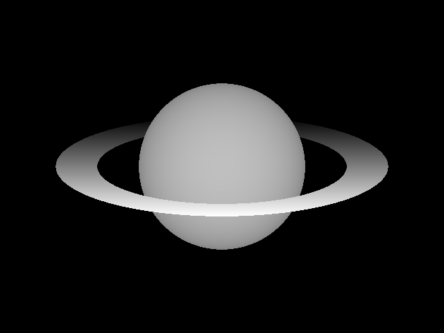

# Auto-stereograms:
### A personal project to explore the creation of auto-stereograms

This is a product of open-source information, being a small Jupyter Notebook which can create a random dot background and then shift specified pixels, ultimately creating a stereogram.

Depth map:

Final image:

